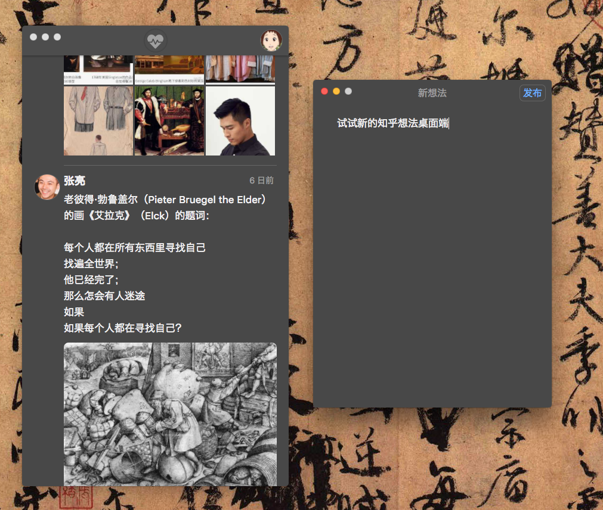

# Zhihu Heartbeat

（非官方）知乎想法桌面端，兼容 macOS 与 Windows。点击[这里](https://github.com/apm1467/zhihu-heartbeat/releases/latest)下载。

## 功能

- 流畅的阅读体验
- 每 10 秒自动更新时间线
- 发布或删除想法
- 在大屏幕上观看高清图片和视频

## macOS

第一次运行可能需要在「系统偏好设置」=>「安全性与隐私」 中点击允许。

## Windows

## 构建方法

本软件使用 [Electron](https://electronjs.org) 框架，macOS 版与 Windows 版需要在各自系统上构建。

1. 安装 [`yarn`](https://yarnpkg.com/lang/en/docs/install/) 
2. `$ cd zhihu-heartbeat/`
3. `$ yarn install`
4. 使用 `$ yarn start` 直接启动应用，或 `$ yarn dist` 输出可执行程序

## 致谢

- 知乎登录部分参照了开源项目 [Zhihu-OAuth](https://github.com/7sDream/zhihu-oauth) 的[方法](http://zhihu-oauth.readthedocs.io/zh_CN/latest/for-dev/oauth/game.html)，欢迎向该项目作者捐款
- 本软件图标和界面均使用了 [Font Awesome](https://fontawesome.com) 的免费图标字体
- 视频播放部分使用了 [hls.js](https://github.com/video-dev/hls.js/) 开源库
- 感谢知乎，希望不要封我
